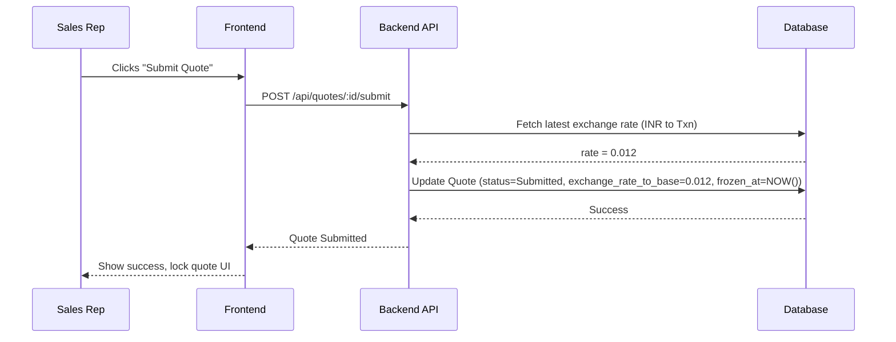
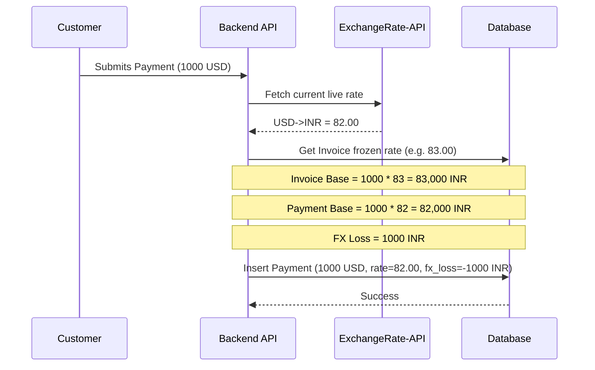

# PRD: Multi-Currency Support

## Overview
B2B sales operations platform (quotation-to-cash) Multi-Currency Support. Provider base currency fixed to INR. Customer-facing docs use transaction currency. Support 9 fixed currencies: USD, EUR, GBP, INR, JPY, AUD, CAD, SGD, AED. Live API rates (ExchangeRate-API). Rates freeze on quote submission. Track FX gains/losses. Extend to subscriptions/recurring billing.

## Goals
- Enable quoting, invoicing, payment in customer transaction currency.
- Maintain base currency (INR) for internal reporting/calculations.
- Automate live exchange rate fetching.
- Lock exchange rates at deal approval/submission.
- Accurately track realized/unrealized FX gains/losses.

## User Stories
- Admin: Manage supported currencies, trigger rate refreshes via Settings UI.
- Sales Rep: Assign transaction currency on Customer Account creation.
- Sales Rep: View both INR and transaction currency side-by-side in Quote Builder.
- Customer: Receive quotes, invoices, pay in transaction currency.
- Finance: View FX gains/losses on payments vs invoices.
- Exec: View consolidated revenue in INR, plus currency breakdowns on Dashboard.

## Functional Requirements
1. **Rate Sourcing**: Fetch rates via `https://v6.exchangerate-api.com/v6/{key}/latest/INR`. Store in DB cache.
2. **Currency Assignment**: Mandatory `transaction_currency` field on `customer_accounts`. Default INR.
3. **Quote Lifecycle**:
   - Draft state: fetch live rates for display, DO NOT freeze.
   - Submitted/Approved state: Freeze exchange rate on `quotations` record.
4. **Calculations**: Margin, discount, risk score computed in INR.
5. **Billing & Subscriptions**: Invoices and subscriptions inherit frozen rate from Quote.
6. **Payments & FX**: 
   - Record payment in transaction currency.
   - Calculate payment base equivalent = payment amount / payment date rate.
   - FX gain/loss = payment base equivalent - invoice base equivalent (using frozen rate).
7. **Catalog**: `products` base list prices/costs strictly INR. `price_lists` can be any currency; items' `custom_unit_price` in list's currency.

## Data Model Changes

### Modified Tables
| Table | Column | Type | Constraints | Description |
|---|---|---|---|---|
| `customer_accounts` | `transaction_currency` | VARCHAR(3) | NOT NULL, DEFAULT 'INR' | Customer's preferred currency |
| `quotations` | `transaction_currency` | VARCHAR(3) | NOT NULL | Inherited from customer account |
| `quotations` | `exchange_rate_to_base` | DECIMAL(15,6) | NULL | Rate frozen at submission |
| `quotations` | `exchange_rate_frozen_at` | TIMESTAMP | NULL | Timestamp of rate freeze |
| `invoices` | `transaction_currency` | VARCHAR(3) | NOT NULL | Inherited from quote |
| `invoices` | `exchange_rate_to_base` | DECIMAL(15,6) | NOT NULL | Inherited frozen rate |
| `invoices` | `fx_realized_gain_loss` | DECIMAL(15,2) | DEFAULT 0.00 | Calculated upon full payment |
| `payments` | `transaction_currency` | VARCHAR(3) | NOT NULL | Payment currency |
| `payments` | `amount_in_transaction_currency` | DECIMAL(15,2) | NOT NULL | Actual payment amount |
| `payments` | `exchange_rate_used` | DECIMAL(15,6) | NOT NULL | Rate at payment time |
| `payments` | `fx_gain_loss` | DECIMAL(15,2) | DEFAULT 0.00 | Difference vs invoice frozen rate |
| `subscriptions` | `transaction_currency` | VARCHAR(3) | NOT NULL | Inherited currency |
| `subscriptions` | `exchange_rate_to_base` | DECIMAL(15,6) | NOT NULL | Frozen rate |
| `subscriptions` | `mrr_amount_transaction` | DECIMAL(15,2) | NOT NULL | MRR in transaction currency |
| `subscriptions` | `arr_amount_transaction` | DECIMAL(15,2) | NOT NULL | ARR in transaction currency |

### New Tables
- `exchange_rates`: `id` (UUID), `base_currency` (VARCHAR(3), 'INR'), `target_currency` (VARCHAR(3)), `rate` (DECIMAL(15,6)), `fetched_at` (TIMESTAMP), `source` (VARCHAR(50)).
- `exchange_rate_history`: `id` (UUID), `base_currency` (VARCHAR(3)), `target_currency` (VARCHAR(3)), `rate` (DECIMAL(15,6)), `recorded_at` (TIMESTAMP).

## API Contracts

### `GET /api/exchange-rates`
- **Desc**: List cached rates.
- **Response**:
```json
{
  "base": "INR",
  "rates": [
    {"currency": "USD", "rate": 0.012, "fetchedAt": "2023-10-01T00:00:00Z"},
    {"currency": "EUR", "rate": 0.011, "fetchedAt": "2023-10-01T00:00:00Z"}
  ]
}
```

### `POST /api/exchange-rates/refresh`
- **Desc**: Trigger manual API fetch.
- **Response**: `{"status": "success", "fetched": 9, "timestamp": "2023-10-01T12:00:00Z"}`

### `GET /api/exchange-rates/convert`
- **Query**: `?amount=100&from=USD&to=INR`
- **Response**: `{"originalAmount": 100, "from": "USD", "to": "INR", "convertedAmount": 8300.00, "rate": 83.00}`

### `GET /api/exchange-rates/history`
- **Query**: `?currency=USD&startDate=YYYY-MM-DD&endDate=YYYY-MM-DD`
- **Response**: Array of historical rate objects.

## UI/UX Specifications
- **Settings > Exchange Rates**: Dedicated page. Table showing target currencies, current cached rates, last fetched timestamp. "Refresh Rates Now" action button.
- **Customer Account UI**: Currency dropdown selector on create/edit form.
- **Quotation Builder**: Dual-currency display on line items. Columns: "Unit Price (INR)", "Unit Price (Txn)", "Line Total (INR)", "Line Total (Txn)".
- **Lists (Quotes, Invoices)**: Data grids include "Currency" column. Filter by Currency.
- **Sales Dashboard**: "FX Impact Summary" widget (net realized gain/loss). "Revenue by Currency" pie/bar chart. Reports show per-currency breakdowns + consolidated INR totals.

## Data Flow Diagrams

### Quote Submission & Rate Freeze Flow


### Payment & FX Gain/Loss Flow


## Edge Cases
- **Rate API Downtime**: Fall back to last cached rate. Raise system alert if cache >24h old.
- **Extreme Volatility**: Add circuit breaker if rate changes >5% in 24h; require admin approval for quote submission.
- **Partial Payments**: Calculate pro-rata FX gain/loss on each payment installment relative to total invoice value.
- **Manual Rate Override**: Not supported in v1. Strictly API-driven.

## Success Metrics
- 0% monetary calculation errors between internal base INR and customer-facing Txn amounts.
- 100% of quotes correctly freeze exchange rates at submission boundary.
- Accurate FX gain/loss reporting verified by Finance end-of-month.

## Phased Rollout
- **Phase 1**: DB migrations, background cron job for ExchangeRate-API fetcher, Admin UI.
- **Phase 2**: Backend API adjustments (Customer, Quote, Invoice, Payment, Subscription) logic.
- **Phase 3**: Frontend UI dual-display updates, list filters.
- **Phase 4**: Finance dashboards & FX impact reports.
